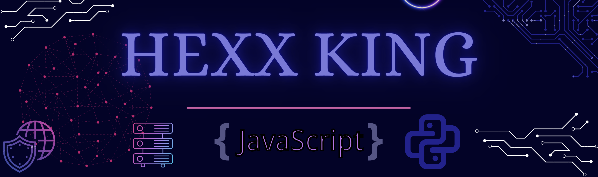
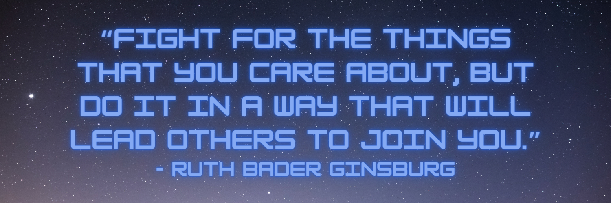

<!--
**HexxKing/HexxKing** is a ✨ _special_ ✨ repository because its `README.md` (this file) appears on your GitHub profile.

Here are some ideas to get you started:

- name/ job title / personal titles
- 🤔 I’m looking for help with ...
- 💬 Ask me about ...
- ⚡ Fun fact: ...

-->

<!-- ======Header============================= -->

<!-- I have a theory that GitHub does not support the ability to open a link in a new tab. I could only find evidence that it is not possible. -->
&nbsp;&nbsp;
&nbsp;&nbsp;
&nbsp;&nbsp;
&nbsp;&nbsp;
&nbsp;&nbsp;

<h2 align="center">Welcome to my GitHub! </h2>

<h3>🧑‍💻 How I Became a Developer</h3>

My story really began when my closest friend convinced me that I have the grit needed to make it through an accelerated software development program. It was March 2020, and I had just successfully led my team of specialists and artists to our most successful sales year, in 15 years. Then COVID-19 came and put my professional life on hold and gave me a moment to reevaluate my career choice. 

I knew that my current position required me to perform lots of jobs outside the traditional "manager" role and that I was able to teach myself any new skills I needed. I took my professional education into my own hands and in return, delivered this knowledge to my employees in an effort to lift the whole team up. 

So if I can do all that while running a studio, why can't I apply this same technique to learning software development? Starting in April 2020, that's exactly what I did. I signed up for classes with Code Fellows and wrote my very first line of code. 

I knew becoming a software developer would mean that I can safely work from home and that is really what made this choice so easy. Because COVID-19 is so deadly, I want to do my best to help save as many lives as we can and working from home is a great way to avoid infection and instigating new mutations. 
 

---------------------
<h3>🐍 My Developer Identity</h3>

### I studied **Full Stack Development** at Code Fellows but I have really found true love in **Data Science** and **Machine Learning**.  I am attracted to the suggestions and facts that can be scientifically deduced from data. Gathering, manipulating and learning from data was part of my previous career and felt like a natural avenue in software development. 

  - ### 🛠️ **Technologies and Tools**

    - **OS** : macOS Catalina, Microsoft Windows
    - **Editor** : Visual Studio Code, Jupyter Notebook
    - **Languages** : Python, SQL, JavaScript(ES6), jQuery, CSS, HTML, Markdown
    - **Frameworks/Layouts/Templates** : Django (REST), PyTest, EJS, Express.js, SMACSS (Scalable and Modular Architecture for CSS), CSS Flexbox & Grid
    - **Libraries/Tools** : React, Whitenoise, JSON Web Tokens, Docker, Selenium with Python, Beautiful Soup, seaborn, matplotlib, scikit-learn, NumPy, Pandas, Pip, Poetry, Heroku, Git, Chrome DevTools, Regex, npm, Node.js, Chart.js

  
  - ### 💎 **Non-Traditional Background**
    #### I never expected to end up working in technology but I have collected many invaluable skills along the way. Check out my past roles and the transferable skills I learned from them.

    - **Competitive Trained Dancer & Professional Ballerina at Houston Ballet - 18 Years**
      - stamina, perseverance, motivation, discipline, creativity, resilience, self-confidence, adaptability, teamwork/collaboration, cultural, self-control, commitment, attention to detail, respect for deadlines, listening and following directions

    - **The Walt Disney Company Cast Member & Disney College Program - 2.5 Years : Attractions, Lifeguard, Entertainment, Animal Programs**
      - customer service, communication, creating a safe environment, working in high volume capacity, product knowledge, linguistics, foretelling negative experiences, creating magic and happiness, friendliness, patience, composure, multitasking, self-care

    - **Craft Cocktail Bartender & Award-Winning Barista - 10 Years**
	    - kinesics, networking/relationship building, improvisation, quick memorization, money-related math, integrity, persuasion, chemistry, stress management, spatial awareness, critical thinking, event planning, time management, attentiveness, enthusiasm

    - **Manager in Professional Body Modification Studio and Luxury Gold Jewelry Brand Ambassador - 4 Years**
	    - Approachability, personal appearance, workplace happiness, mentorship, professionalism, brand image, digital marketing, sales, motivation, employee development, polietness, payroll, auditing, inventory management, accountability, consistency, leadership, self-learning, problem-solving, data analysis, analytical thinking, graphic design, merchandising, public health education, documentation, technology trouble-shooting, interviewing/hiring, public speaking, grace

  - ### 🌟 **Professional Competencies**
    - A Growth Mindset:
      - Ability to deal with ambiguous situations and solve problems with agility
      - Envision beyond the responsibility of my role
      - Build a career across multiple disciplines
      - Attend every opportunity to learn and grow as a professional and a better human 

    - Diverse and Inclusive:
      - Empower every person to achieve more
      - Influencing others by encouraging communication
      - Lifting up "Non-Traditional Backgrounds"
      - Create a safe working environment for everyone
      - Community outreach through volunteering

    - Leadership & Collaboration:
      - Effectively communicating within a team and across teams
      - Positively influencing others by setting a good example 
      - Working tenaciously to deliver on commitments
      - Constantly seeking bigger challenges
      - Holding yourself and others accountable

  <!-- Start a twitter hashtag that I can later link to here #ThisIsWhyIWantToWorkInTech -->
  - ### 🌈 **Why I Want to Work in Tech**
    - Working from home is safest during a pandemic.
    - I am ready for a liveable wage, excellent healthcare and rewarding benefits.
    - My ability to adapt allows me to change my professional career.
    - I am a lifelong learner looking to keep life interesting.
    - I recognize that software and technology is the future.
    - The women and queer developer community is welcoming and supportive.
    - I want to empower other queer people and women to join the tech community.
    - I want to help make the world a more accessible place for everyone.
    - The relentless spread of misinformation on the internet affects everyone's quality of life and I want to stop it.
    - Cyber crime is on the rise and I want to help make the world safer.

  - ### 👭 **My Favorite Organizations**
    - [Code Fellows Alumni](https://www.linkedin.com/school/code-fellows/people/)
    - [Lesbians Who Tech](https://lesbianswhotech.org/about/)
    - [Out in Tech](https://outintech.com/)
    - [PyLadies](https://pyladies.com/)
    - [Code Newbie](https://www.codenewbie.org/)
    - [PuPPy](https://www.pspython.com/app/)
    - [Tech Ladies](https://www.hiretechladies.com/)

---------------------
<h3>✍️ What I'm Working On</h3>

  - [Kaggle : Titanic - Machine Learning from Disaster](https://www.kaggle.com/c/titanic)
  - [LeetCode : Arrays 101](https://leetcode.com/hexxking13/)
  - [HackerRank : 10 Days of JavaScript](https://www.hackerrank.com/hexxking13)

---------------------
<h3>💡 What I'm Learning</h3>

  - [Solo Learn : DS with Python Course](https://www.sololearn.com/profile/18994378)
  - [Udemy : Python Crash Course for Data Science and Machine Learning Course](https://www.udemy.com/course/python-crash-course-for-data-science-and-machine-learning/)
  - [Microsoft Learn : Azure Fundamentals part 1: Describe core Azure concepts](https://docs.microsoft.com/en-us/learn/paths/az-900-describe-cloud-concepts/)

---------------------
<h3>🎟️ Events I'm Attending</h3>

  - [Elevate](https://girlgeek.io/conferences/elevate2021/) - 03/08/21
    - The 4th annual Girl Geek X: Elevate virtual conference for mid-to-senior level women is a full day of talks on leadership, resilience, inclusive research, modernizing mobile codebases, strategies for remote teams, security, AI, and more!

  - [PyCascades](https://2021.pycascades.com/) - 02/20/21
    - PyCascades is organized by members of the Python communities in Vancouver, Seattle, and Portland. It is a 2 day virtual conference that aims to bring together Python users and developers from around the world.

---------------------

---------------------

<h3>📻 My Favorite Coding Playlists</h3>

  - [Pop Goes Classical](https://open.spotify.com/playlist/37i9dQZF1DWUPafHP1BJw1?si=9JTN8J_bS0iVzTT0GeULzA)
  - [Dark Wave](https://open.spotify.com/playlist/2B38PQb9QByEVSyKcuFLyh?si=Jhk4YMk-ShS_z_N_QFj3uA)
  - [Brain Power](https://open.spotify.com/playlist/7KxpNGzqnlzXdQxrgF7aBV?si=mmOXpl3zShuvYp-GWeKaRQ)
  - [Bad Girls Do It Well](https://open.spotify.com/playlist/0rst8pDrV7wTC7iZg01G2j?si=TEOv8awtTn66bPXcy_LWtA)
  - [Acoustic Rock](https://open.spotify.com/playlist/37i9dQZF1DX0rCrO4CFRfM?si=Fi5-1AocQFiaBFmYmuXQhA)

<!-- --------------------- -->
<!-- <h3>👭 What I'm Contributing To</h3> -->

---------------------
<h3>👽 Fun Facts</h3>

  - Retired Disney Princess
  - Studied 14 Different Styles of Dance over 18 Years
  - Took Up Longboarding at 25 and Roller Skating at 30 Years Old
  - Collects Carnivorous Plants
  - Performed Burlesque with a Troupe of Drag Kings
  - Collected over 1,000 Hours of Tattoo Artwork and Body Modifications
  - Studied the Spanish Language and Mexican Culture for 6 Years
  - Tarot Reader for 6 Years
  - Enjoys All Venues of Self-Improvement
  - Wants to Build an EarthShip One Day

---------------------
<!-- ======FOOTER============================= -->
<footer>
<h3>📚 Resources:</h3>

- Header from <a href="https://www.canva.com/">Canva</a>
- Social media favicons from <a href="https://icons8.com">Icons8</a>
- <a href="https://towardsdatascience.com/build-a-stunning-readme-for-your-github-profile-9b80434fe5d7">Build a Stunning README For Your GitHub Profile</a>
- <a href="https://sarah-hart-landolt.medium.com/6-easy-steps-to-create-a-beautiful-github-profile-readme-edc7840b2c7">6 Easy Steps to Create a Beautiful GitHub Profile README</a>
- <a href="https://docs.github.com/en/github/setting-up-and-managing-your-github-profile">Setting up and managing your GitHub profile
</a>
</footer>

