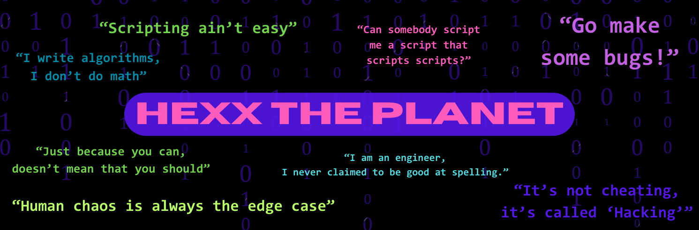

<h2 align="center">Welcome to my GitHub!</h2>

<!-- I have a theory that GitHub does not support the ability to open a link in a new tab. I could only find evidence that it is not possible. -->
&nbsp;&nbsp;
<!-- &nbsp;&nbsp; -->
&nbsp;&nbsp;
<!-- &nbsp;&nbsp; -->

---------------------
<h2>🧑‍💻 How I Became a Developer</h2>

In the wake of the COVID-19 pandemic, like many, I found myself pondering life's possibilities. In March 2020, as we were asked to step away from our jobs and stay home due to safety concerns, I recognized a unique opportunity for a career change. With time at my disposal and no immediate commitments, I embarked on a long journey of coding.

Encouraged by a developer friend, I enrolled in an intensive software development program. Nine months later, I proudly graduated from Code Fellows, armed with a plethora of new skills. In March 2021, I took my first steps into the technology industry as a teaching assistant and tutor at Code Fellows and then soon found myself promoted to Lead Instructor.

Currently, my focus is on honing my problem-solving prowess, delving deeper into networking and cybersecurity, and pursuing skill certifications. 

Let's embark on this tech adventure together, shall we? 😄  

---

---

## 🛠️ Technologies and Tools

  - **Languages:** Bash, Python, JavaScript, SQL, CSS, HTML, Markdown
  - **Frameworks:** React, Bootstrap, SciKit-Learn, NLTK, Pandas, Numpy, Django, Node.js, PyTest, jQuery
  - **Tools:** Visual Studio Code, Jupyter Notebooks, Wireshark, Nmap, Cisco Packet Tracer, RADIUS, OpenVPN, Powershell, Git, CLI, Docker, GitHub, Postman
  - **Operating Systems:** MacOS, Windows OS, Windows Server, Ubuntu OS, Ubuntu Server, Kali Linux, pfSense
  - **Platforms:** AWS, Windows Active Directory, Heroku
  - **Databases:** MongoDB, PostgreSQL

---

---

## 🌟 Professional Competencies

  - **A Growth Mindset:**
    - Ability to deal with ambiguous situations and solve problems with agility
    - Envision beyond the responsibility of my role
    - Build a career across multiple disciplines
    - Attend every opportunity to learn and grow as a professional and a better human 

  - **Diverse and Inclusive:**
    - Empower every person to achieve more
    - Influencing others by encouraging communication
    - Lifting up "Non-Traditional Backgrounds"
    - Create a safe working environment for everyone
    - Community outreach through volunteering

  - **Leadership & Collaboration:**
    - Effectively communicating within a team and across teams
    - Positively influencing others by setting a good example 
    - Working tenaciously to deliver on commitments
    - Constantly seeking bigger challenges
    - Holding yourself and others accountable

---------------------

---------------------

## 👭 **My Favorite Organizations**
  - [Code Fellows Alumni](https://www.linkedin.com/school/code-fellows/people/)
  - [Lesbians Who Tech](https://lesbianswhotech.org/about/)
  - [Out in Tech](https://outintech.com/)
  - [PyLadies](https://pyladies.com/)
  - [Code Newbie](https://www.codenewbie.org/)
  - [PuPPy](https://www.pspython.com/app/)
  - [Tech Ladies](https://www.hiretechladies.com/)

---------------------

---------------------

<h2>📻 My Favorite Coding Playlists</h2>

  - [Zelda Lofi & Chill](https://open.spotify.com/playlist/0NCU27543csVHq1A8FdPYy?si=ddf9745ccd6b47ac)
  - [Pop Goes Classical](https://open.spotify.com/playlist/37i9dQZF1DWUPafHP1BJw1?si=9JTN8J_bS0iVzTT0GeULzA)
  - [Brain Power](https://open.spotify.com/playlist/7KxpNGzqnlzXdQxrgF7aBV?si=mmOXpl3zShuvYp-GWeKaRQ)
  - [Acoustic Rock](https://open.spotify.com/playlist/37i9dQZF1DX0rCrO4CFRfM?si=Fi5-1AocQFiaBFmYmuXQhA)

---

---

<h2>🎮 Currently Gaming</h2>

  

    - [Legend of Zelda - Tears of the Kingdom](https://www.youtube.com/watch?v=uHGShqcAHlQ&ab_channel=NintendoofAmerica)
    - [Disney Dreamlight Valley](https://www.youtube.com/watch?v=TGjusKg-efs&t=1s&ab_channel=DisneyDreamlightValley)
    - [Mario Kart 8 Deluxe](https://www.youtube.com/watch?v=BiJ7IoeuhXE&ab_channel=NintendoofAmerica)
  

  

    
  

---

<h2>👽 Fun Facts</h2>

  - Great Dane Mom
  - Building a Food Forest in My Backyard
  - Retired Disney Princess
  - Studied 14 Different Styles of Dance over 18 Years
  - Took Up Longboarding at 25 and Roller Skating at 30 Years Old
  - Collects Carnivorous Plants
  - Performed Burlesque with a Troupe of Drag Kings
  - Collected over 1,000 Hours of Tattoo Artwork and Body Modifications
  - Studied the Spanish Language and Mexican Culture for 6 Years
  - Tarot Reader for 9 Years
  - Enjoys All Venues of Self-Improvement
  - Wants to Build an EarthShip One Day

---

<h3 align="center">Don't forget to check out my resume!</h3>

&nbsp;&nbsp;

---

<footer>
<h3>📚 Resources Used to Build This Repo:</h3>

- Header from <a href="https://www.canva.com/">Canva</a>
- Social media favicons from <a href="https://icons8.com">Icons8</a>
- <a href="https://towardsdatascience.com/build-a-stunning-readme-for-your-github-profile-9b80434fe5d7">Build a Stunning README For Your GitHub Profile</a>
- <a href="https://sarah-hart-landolt.medium.com/6-easy-steps-to-create-a-beautiful-github-profile-readme-edc7840b2c7">6 Easy Steps to Create a Beautiful GitHub Profile README</a>
- <a href="https://docs.github.com/en/github/setting-up-and-managing-your-github-profile">Setting up and managing your GitHub profile</a>
- <a href="https://github.com/antonkomarev/github-profile-views-counter">GitHub Profile Views Counter</a>
</footer>
